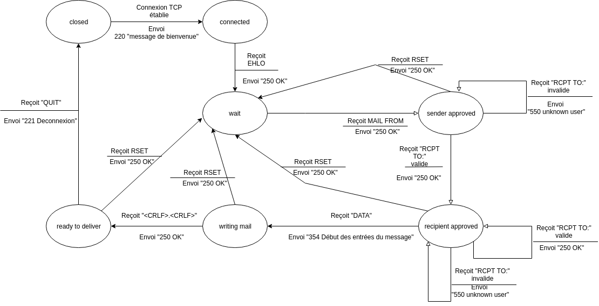

# SMTP
SMTP  


On a crée la classe suivante :
```java
class BdConnexion{
    
        public static List<Utilisateur> getUtilisateurs();
        public static Utilisateur getUtilisateur(String email);
        public static MailBox getMessages(Utilisateur utilisateur);
        
}
```
Cette méthode nous permet de récupérer les données dans notre basse de donnée et de les transformer en objet.  