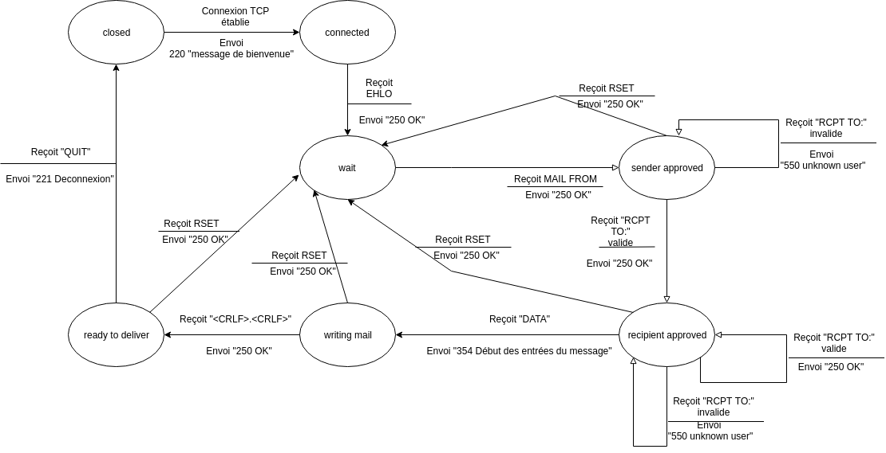
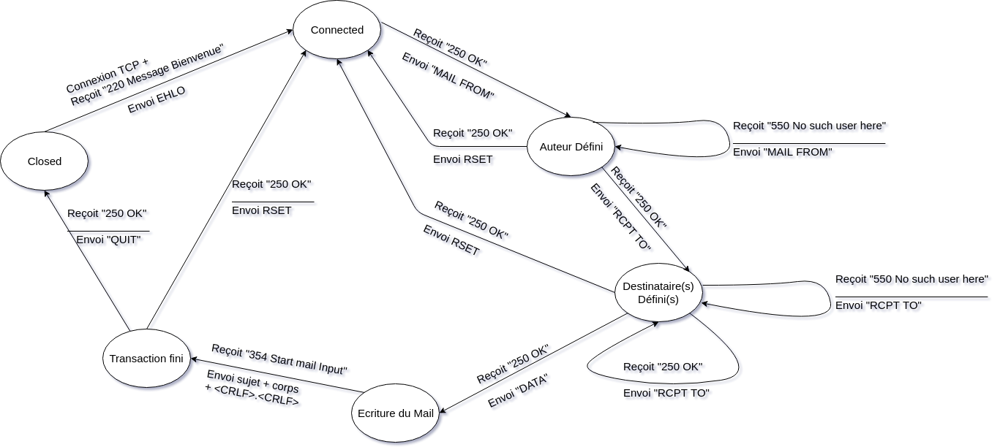

# SMTP
**Reprise de code de POP3**  
Pour ne pas refaire un code à partir de 0, nous nous sommes servis du code du projet POP3.  
Par exemple, on peut revoir les méthodes d'écritures et de lecture de flux via la connexion TCP
Nous repronons le code mais l'améliorons également, ainsi nous avons refactorer les méthodes de réecriture dans la classe suivante  
```java
public class StreamHandling {

    public static void write(String message, OutputStream outputStream) {
        PrintWriter outToClient = new PrintWriter(outputStream);
        outToClient.write(message);
        outToClient.println();
        outToClient.flush();
    }

    public static String read(InputStream inputStream) {
        String result = "";
        try {
            BufferedReader fromClient = new BufferedReader(new InputStreamReader(inputStream));
            result = fromClient.readLine();
        } catch (IOException e) {
            e.printStackTrace();
        }
        return result;
    }

    public static String readMultipleLines(InputStream inputStream) {
        StringBuilder data = new StringBuilder();
        try {
            BufferedReader fromServer = new BufferedReader(new InputStreamReader(inputStream));
            String tmp = fromServer.readLine();
            do {
                data.append(tmp).append("\n");
                tmp = fromServer.readLine();
            } while (tmp.length() > 0 && tmp.charAt(0) != '.');
        } catch (IOException e) {
            e.printStackTrace();
        }
        return data.toString();
    }
}
```
On a également crée la classe suivante :
```java
class BdConnexion{
    
        public static List<Utilisateur> getUtilisateurs();
        public static Utilisateur getUtilisateur(String email);
        public static MailBox getMessages(Utilisateur utilisateur);
        
}
```
Cette classe nous permet de récupérer les données dans notre basse de donnée et de les transformer en objet.  

**Le protocole SMTP**
Avant de développer, nous avons pris le temps d'élaborer des automates pour le Serveur et le Client
*Automate serveur*

*Automate serveur*

Ces automates définissent la futur implémentation du code.  
Pour ne pas laisser place à d'éventuels bugs, nous avons réalisé pour le clientSmtp ainsi que pour le serveur des tables de transitions qui anticipent les différentes requêtes.  
Ces documents sont disponibles dans le dossier doc.
##Implémentation smtp Côté Serveur

Comme pour l'implémentation du protocole POP3, nous avons une classe Enum qui répertorie les différents états de la connexion smtp :
```java
public  enum StateEnum {CLOSED, CONNECTED, WAIT, SENDER_APPROVED,RECIPIENT_APPROVED,WRITING_MAIL,READY_TO_DELIVER, READY}
```
Nous avons créé une classe Enum permettant de répertorier les messages côté smtp et Client envoyé
```java
public enum SmtpCodes {
    SeServerSmtptp
    AUTHENTIFICATED("220 Bienvenue sur le Serveur STMP de Mark-Florian-Fabien"),
    OK("250 OK"),
    USER_UNKNOWN("550 Cet utilisateur n'existe pas"),
    MESSAGE("354 Start mail input; end with <CRLF>.<CRLF>"),
    LOGOUT("221 Deconnexion"),
    COMMAND_UNKNOWN("500 Syntax error, command unrecognized"),
    COMMAND_NOTIMPLEMENTED("502 Command not implemented"),
    WRONG_COMMAND("503 Bad sequence of commands"),
    clientSmtp
    MAIL_FROM("MAIL FROM:"),
    RCPT_TO("RCPT TO:"),
    RESET("RSET"),
    EHLO("EHLO "),
    DATA("DATA"),
    QUIT("QUIT"),
    //Not from Stmp but for checking for password
    WRONG_PASSWORD("500 mauvais mot de passe"),
    READY("ready");

    private String message;

    SmtpCodes(String message) {
        this.message = message;
    }

    @Override
    public String toString() {
        return this.message;
    }
}
```

**Gestion authentification**
Comme le protocole smtp nous laisse libre quant à l'identification de l'utilisateur,
Nous avons décidé, de envoyer un à un le mail ainsi que le mot de passe au serverPop3.
```java
public boolean authentification() {
        write(this.getUtilisateur().getEmail());
        write(this.getUtilisateur().getMdp());
        String response = read();
        if (response.equals(SmtpCodes.AUTHENTIFICATED.toString())) {
            return true;
        }
        return false;
    }
```
Une fois le clientSmtp identifié, il enverra alors la commande EHLO où nous rentrons dans le protocole.
